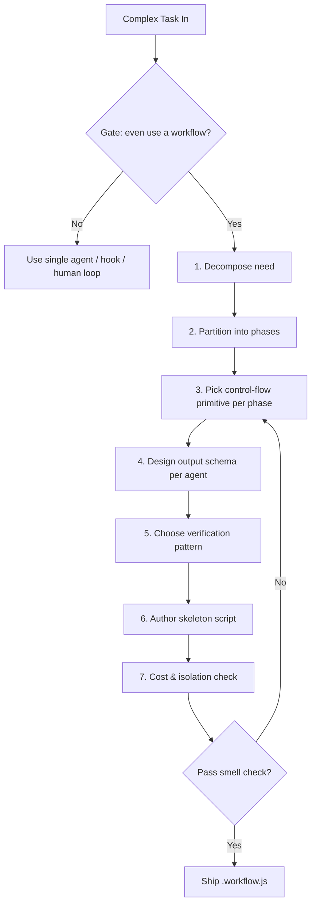

# Workflow Design

## Overview

Workflow is a tool (peers with `Read`/`Bash`) that lets Claude write a plan as a JS script executed by a background runtime. The script opens with `export const meta = { name, description, phases }` and the body orchestrates subagents via `agent()` / `pipeline()` / `parallel()` / `phase()` / `log()` / `args` / `budget`. The plan lives in the script, not in Claude's head: intermediate results stay in script variables and only the final answer returns to the session context, so a single run can scale to hundreds of agents without blowing the context window.

This skill teaches **how to design** such a script — not how to invoke one. It is the design-time companion of the shared `workflow-good-practices.md` kernel (the same ruler used by `workflow-review`). Internalize that kernel before designing; this skill reframes it as a procedure.

## Design Flow



The 7 steps above are elaborated in `references/design-procedure.md`. The inline sections below are the design-time cheat-sheet — the Gate, the load-bearing principles, the meta-patterns to reach for, a worked example, and the references — not a parallel restatement of the 7 steps.

## Gate: Should you even use a workflow?

Use a workflow only if **at least one** holds (full criteria in `workflow-good-practices.md` §1):

- **Breadth** — fan-out over independent views/sources/shards is required to cover the work (multi-modal sweep, repo-wide audit, cross-directory migration).
- **Verification** — output is high-cost and needs adversarial check before trust (findings → refute → accept).
- **Scale** — the work does not fit one context (migrations, batch refactor, large-scale test repair).
- **Reuse** — the same "survey→fix→verify" structure repeats across many objects.
- **Determinism** — control flow must be pinned so the LLM cannot improvise each round.

Do NOT use a workflow when:

- One agent iterating turn-by-turn can finish it — let one agent do it.
- Human input is needed mid-loop — a workflow cannot receive input mid-run; split into multiple workflows with sign-off between.
- Token cost is mismatched with breadth — dozens of agents for trivial gain is not worth it.
- A mechanical constraint can be enforced by regex/hook — use a hook, not a skill/workflow.

## Design Principles (inline)

1. **Plan in the script, not in the head.** Every phase boundary, data dependency, and early-exit condition is explicit code. If you can't name the data flow arrow (`a → b → c`), you don't have a design yet.
2. **Pick the primitive by the dependency shape, not by vibes.** `pipeline` = same item across stages with data passing; `parallel` = barrier because the next phase needs *all* results. The single most common design error is `parallel → transform → parallel` with no cross-item dependency — that should be a `pipeline`. See `references/mode-selection-guide.md`.
3. **Schema at the tool-call layer, never "return JSON" in the prompt.** Every finding carries an executable `fix` field so a downstream agent can apply it mechanically. Review-style agents return `accept: boolean` + `bugs: [...]`.
4. **Verification is adversarial by default.** "Default to refuted / ok=false"; give the verifier a concrete anti-pattern checklist, not "check correctness"; declare explicit exemptions to cut false positives; short-circuit stubs.
5. **Determinism over freedom.** Force paths/directory isolation (computed paths override agent self-reported ones), `git add <exact files>` not `git add -A`, one build per round (NO_BUILD), diagnostics files as the communication medium.
6. **Isolation matches write conflict risk.** Parallel agents writing the same file MUST use `isolation: "worktree"` or disjoint file domains; strongest pattern is "agent produces a diff, orchestrator commits."
7. **Observe and budget.** `label` as `kind:short-path`; agents return counts, the workflow `reduce`s to top-level stats; pilot on a small slice before a big run; route low-value stages to a smaller `model`.
8. **Forbid nondeterminism.** No `Date.now()`, `Math.random()`, no-arg `new Date()` — the runtime throws. Pass timestamps in via `args`; vary prompts/labels by index.
9. **Bound every loop.** `MAX_ROUNDS` / `MAX_FILES` / guard `budget.total` for null. Loop-until-dry must dedup against the **seen superset**, not just confirmed results, or rejected findings recur forever.
10. **`meta.phases` mirrors `phase()` calls.** The declarative phase directory (human-reads) and the runtime progress markers couple loosely via the title string — keep them in sync or the UI lies.

## Concrete meta-patterns to reach for

These are the load-bearing shapes cited from the shared kernel (`workflow-good-practices.md` §10). Pick one before authoring; do not invent novel topology without reason.

- **Implement→Verify→Fix pipeline** — each item independently: `pipeline(items, impl, verify, fix)`. Fix consumes verify's `issues` JSON.
- **2-vote adversarial verify + dedup** — `parallel([vote1, vote2]).then(dedup by key)`; `accepted = every accept`. The mainstream verification pattern.
- **Survey→Fan-out→Re-survey loop** — `for round in MAX_ROUNDS: survey → pipeline(frontier, fix, verify, bugfix)`. Working set shrinks each round.
- **NO_BUILD swarm** — ONE rebuild per round; survey writes `.diag`/`.baseline` to /tmp; fix/review/apply agents are read-only over source.
- **Worktree patch return** — fix agent in isolated worktree produces a patch string; reviewer audits the patch; orchestrator applies. Agents never touch git.
- **5-stage dedup/unsafe-wrap** — Find(shard) → CrossRef/Coalesce(synth) → Verify(2-vote) → Apply(Edit only) → Compile (single cargo agent).

### Multi-workflow & constraint patterns (from Bun 53-workflow practice)

- **Multi-workflow suite** — split >300-line / >12-round / ≥3-stage workflows into independent phase-lettered scripts (e.g. `phase-a-adapt`, `phase-d-build-queue`, `phase-g-test-swarm`). Each self-surveys the git tree; file-system-as-state, not return-value chaining. See `references/multi-workflow-guide.md`.
- **Constraint layers** — extract HARD_RULES / BANS / TAXONOMY / CHECKLIST as named `const` strings; compose per agent role (`fixPrompt = HARD + BANS + task`; `verifyPrompt = HARD + CHECKLIST + task`). See `references/constraint-layers-guide.md`.
- **Compile-queue** — build errors ARE the work queue: `survey(build) → group by file → pipeline(frontier, fix(NO_BUILD), 2-vote-verify, bugfix) → re-survey until link_ok`. Frontier priority: unseen-first, then most-errors-first. Stuck detection stops early. See good-practices §14.
- **Tier-ordered processing** — when items have dependency order (crate DAG, module layers), process low-tier first so high-tier sees real definitions. `for (const tier of TIERS) { pipeline(tier.files, ...) }`.
- **FAIL_BATCH survey** — stop survey after N failures (`[ $fails -ge ${FAIL_BATCH} ] && break`), fix that batch, re-survey. Saves tokens on heavily-broken codebases.

## Worked example

A representative complex task: **codebase audit fan-out → adversarial verify → synthesize**. Full annotated `.workflow.js` is in `references/skeleton-template.md` (the "Worked example" section). Its shape:

```
meta.phases = [Survey, Verify, Synthesize]
Survey    : parallel(one agent per dimension: correctness/security/perf/repro)
            → flatten findings, each with executable `fix`
            → early-exit if findings.length === 0 (legitimate barrier use #2)
Verify    : pipeline(findings, per-finding parallel([vote1, vote2])).then(dedup by location)
            → accepted = findings where every vote.accept
Synthesize: single agent reads accepted findings → ranked report
```

Note the three principles visible in the shape: `parallel` barrier at Survey because Synthesize needs *all* dimensions; per-finding `parallel` 2-vote inside a `pipeline` (votes are independent → parallel, not pipeline; each finding is its own pipeline item); `fix` field on every finding so the dedup/apply step is mechanical.

## References

- `references/workflow-good-practices.md` — the shared kernel; the single source of truth for "what is a good workflow." Read first.
- `references/design-procedure.md` — the 7-step design procedure (decompose → phase → primitive → schema → verify → skeleton → cost).
- `references/mode-selection-guide.md` — pipeline vs parallel vs swarm vs loop, with a decision table and "when each."
- `references/skeleton-template.md` — annotated `.workflow.js` skeleton + meta/agent/pipeline/parallel/schema examples + the worked example.
- `references/anti-patterns.md` — bad workflow smells to catch at design time.
- `references/multi-workflow-guide.md` — multi-workflow orchestration: phase naming, state passing, independent retry, sharding, FAIL_BATCH, stuck detection. Deep expansion of good-practices §12/§15.
- `references/constraint-layers-guide.md` — constraint layering (HARD_RULES / BANS / TAXONOMY / CHECKLIST): design templates and annotated examples from Bun. Deep expansion of good-practices §13.

Sibling skills (cross-reference by name only): `plan-review`, `code-review`, `workflow-review` (the review-time mirror of this skill).
